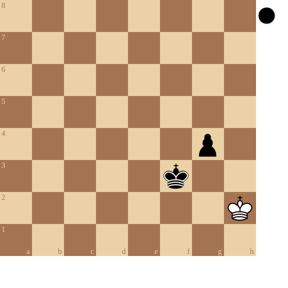

+++
date = '2026-04-15T10:32:14+02:00'
title = 'Basis pion eindspel 4'
+++

<!--
.diagram puzzle.pgn
-->

Dit is het eindspel uit de partij Maroczy - Marshall gespeeld in 1903 te Monte Carlo.

Zwart speelt en wint!

<!--
.puzzle puzzle.pgn
-->

&#160;

