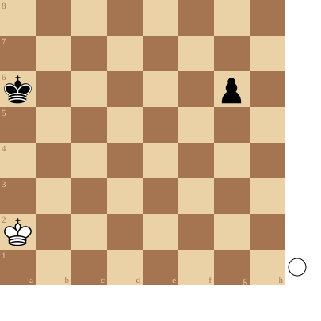

+++
date = '2026-04-15T11:11:29+02:00'
title = 'Basis pion eindspel 5'
+++

<!--
.diagram puzzle.pgn
-->

Dit is een gevecht om de sleutelvelden en de oppositie.

Wit speelt en houdt remise.

<!--
.puzzle puzzle.pgn
-->

&#160;

