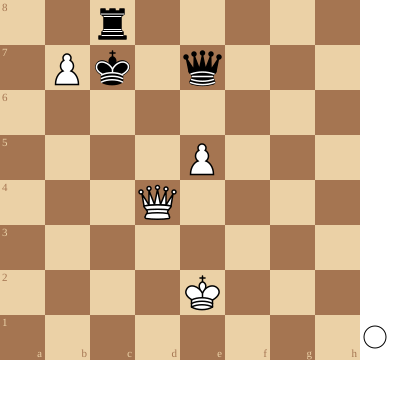

+++
date = 2026-04-11T13:45:30+02:00
title = "Winnen van  uit een onmogelijke positie"
weight = 9223372036656708277
+++

<!--
.diagram puzzle.pgn
-->

Wit speelt en wint!

<!--
.tube https://www.youtube.com/watch?v=EqrUVsVUvAg
-->


<!--
.dropbox https://www.dropbox.com/scl/fi/9a569r8gs5brexn9tyw8l/White-to-move-and-win-and-it-s-amazing.mp4?rlkey=psn5dz2qhffzzmxykdfliz05m&dl=0
-->
Je kan de video ook bekijken op [dropbox](https://www.dropbox.com/scl/fi/9a569r8gs5brexn9tyw8l/White-to-move-and-win-and-it-s-amazing.mp4?rlkey=psn5dz2qhffzzmxykdfliz05m&dl=0)

<!--
.puzzle puzzle.pgn
-->

&#160;

