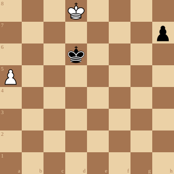

+++
date = '2026-04-02T18:33:54+02:00'
draft = false
title = 'Een puzzel die doet denken aan Reti'
+++

In deze puzzel is Wit aan zet.

Hoe slaagt hij er in om gelijkspel te houden!



Je kan de video ook bekijken op [dropbox](https://www.dropbox.com/scl/fi/v2x7g1e77na6iu03q150y/Believe-It-Or-Not-This-Position-Is-Draw.mp4?rlkey=ol5ijy5nlm0q3hfzjej370oke&st=1rcksy1k&dl=0)

&#160;

