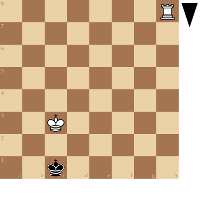
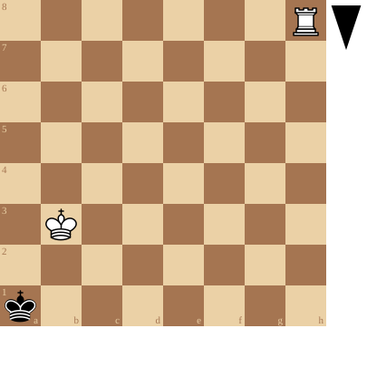
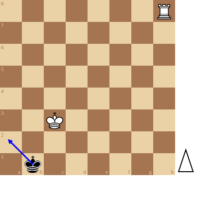
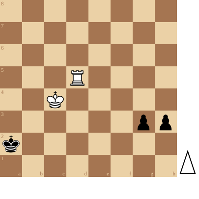

+++
date = '2026-09-29T13:23:49+02:00'
title = 'Toren tegen pion (2)'
weight = 9223372036641935178
+++

Eerste basisstelling

<!--
.diagram fen:7R/8/8/8/8/2K5/8/2k5 b - - 0 1
-->

Zwart gaat deze partij verliezen maar kan voorlopig ontsnappen

Tweede basisstelling

<!--
.diagram fen:7R/8/8/8/8/1K6/8/k7 b - - 0 1
-->

Zwart kan niet ontsnappen: de volgende zet van Wit staat hij schaakmat

Derde basisstelling

<!--
.diagram fen:7R/8/8/8/8/2K5/8/1k6 w - - 0 1; arrow:b1a2
-->

Wit aan zet. Speelt hij Th1, dan moet de zwarte koning naar a2. Daar staat de koning vast! Dit wil zeggen, dat als Wit dit kan vast houden, Zwart ofwel pat staat, ofwel met andere stukken *MOET* spelen.

<!--
.diagram puzzle.pgn
-->

Een toren die het moet opnemen tegen 2 verbonden pionnen die de 6e (3e) rij bereiken is meestal reddeloos verloren: er gaat altijd wel 1 van de pionnen promoveren.
In deze stelling staat de zwarte koning erg ongelukkig en door gebruik te maken van de 3 basisstellingen gaat de koning+toren toch het pleit in zijn voordeel beslechten.

<!--
.yt MQA5JfpRWJI
-->


Je kan de video ook bekijken op [dropbox](https://www.dropbox.com/scl/fi/nw0net2psslc2adto6ead/Best_chess_study_ever_MQA5JfpRWJI.mp4?rlkey=numin2cc76w4qoch2a0q3o3ft&dl=0)
<!--
.game puzzle.pgn
-->

<!-- Game begin -->
<link href="/okra/js/lichess/pgn/lichess-pgn-viewer.css" type="text/css" rel="stylesheet" />

&#160;

<!-- Game end -->

