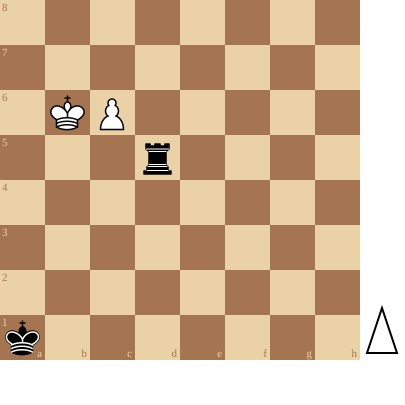

+++
date = '2026-09-20T16:10:12+02:00'
title = 'Toren tegen pion (1): de Saavedra positie'
weight = 9223372036642702795
+++

Eindspelen van een toren tegen pion zijn vanzelfsprekend meestal gewonnen voor de toren. Toch zijn er heel wat situaties waar dit niet zo vanzelfsprekend is.

De bekendste van deze eindspelen is ongetwijfeld de [Saavedra positie](https://nl.wikipedia.org/wiki/Saavedra-positie)

<!--
.diagram puzzle.pgn
-->

<!--
.yt WIlM2JOb7dU
-->


Je kan de video ook bekijken op [dropbox](https://www.dropbox.com/scl/fi/tlufa5626vikj2sp57og3/Brilliant_endgame_tactics_in_the_Saavedra_positi.mp4?rlkey=dnfbjne79wzd7o8w80dtnle0i&dl=0)
<!--
.game puzzle.pgn
-->

<!-- Game begin -->
<link href="/okra/js/lichess/pgn/lichess-pgn-viewer.css" type="text/css" rel="stylesheet" />

&#160;

<!-- Game end -->

