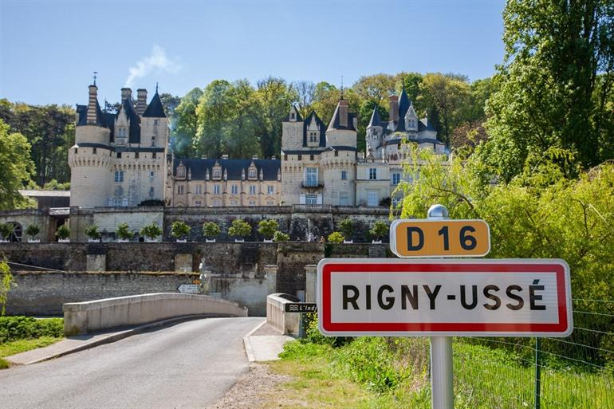
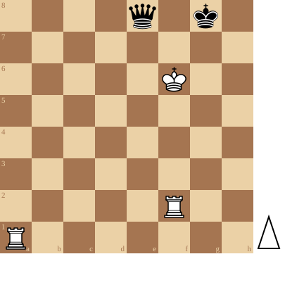

+++
date = 2026-08-11T17:20:50+02:00
title = "Torens versus Dame studies (7)"
weight = 9223372036646154557
+++

<!--
.image castle.jpg
-->

[Château d'Ussé](https://www.reisroutes.be/blog/loirevallei/mooiste-kastelen-loire/)

Château d'Ussé

Het kasteel van Ussé staat in de regio bekend als het kasteel van Doornroosje. Charles Perrault had bij het schrijven van zijn sprookje namelijk dit kasteel in gedachten. Neem zeker een kijkje in de kerkers van het kasteel waar verschillende scènes uit het sprookje van Doornroosje nagespeeld worden.

Een puzzel met doornen:

<!--
.diagram puzzle.pgn
-->

<!--
.yt https://www.youtube.com/watch?v=LyXn9f4EAHA&list=PLlN1WdzKJmlLS17Yu35d7HPJqvpL9VKwM&index=45
-->


Je kan de video ook bekijken op [dropbox](https://www.dropbox.com/scl/fi/4fxf6mi514g0ww9r4lhe8/You_Win_This_With_White_LyXn9f4EAHA.mp4?rlkey=cjymebsrhkq76njmgi5fr72ip&dl=0)

<!--
.puzzle puzzle.pgn
-->

(Je kan de partij <a href="puzzle.pgn">hier</a> downloaden in PGN formaat)

&#160;

