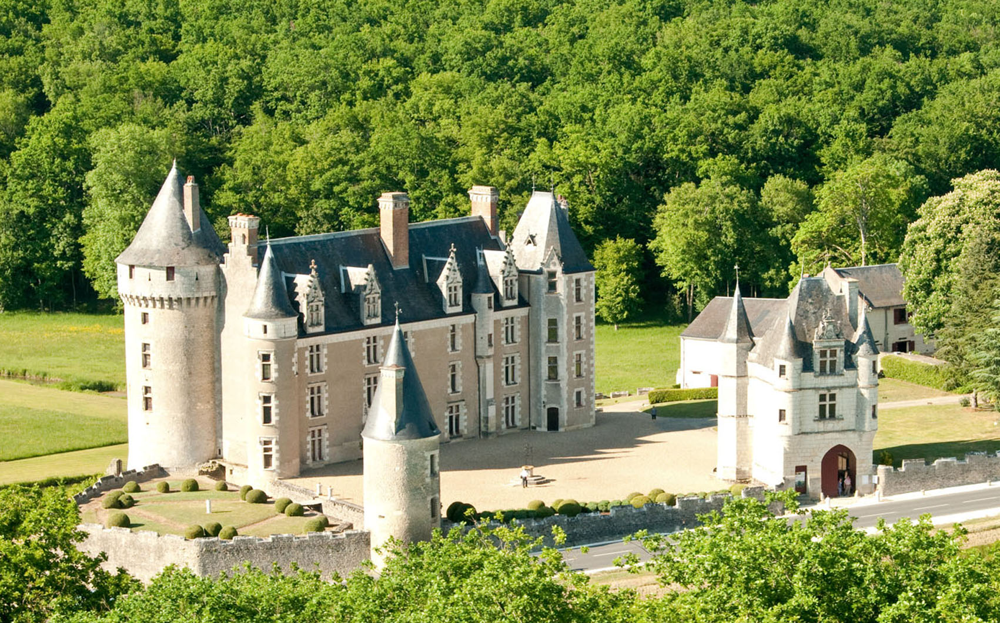
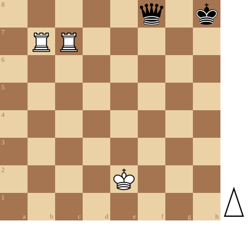

+++
date = '2026-08-03T18:10:36+02:00'
title = 'Torens versus Dame studies'
+++

Ach, virtuele vakantie in de Loire streek...

Dromen van kastelen en de koninginnen in de torens van die kastelen.

Elke dag dat ik er ben, wil ik een kasteel tonen, samen met een eindspelstudie waarbij torens en koninginnen strijden.

Château de Montpoupon: mijn favouriet kasteel!
<!--
.image castle.jpg
-->

<!--
.diagram puzzle.pgn
-->

Toon hoe Wit toch weet te winnen!

<!--
.yt https://www.youtube.com/watch?v=kzfj2mEcJCY
-->


Je kan de video ook bekijken op [dropbox](https://www.dropbox.com/scl/fi/3waejm3bcgn399vj161px/How_Do_You_Win_With_Two_Rooks_kzfj2mEcJCY.mp4?rlkey=q0nykt2sqzlkugt6bki6sscpf&dl=0)

<!--
.puzzle puzzle.pgn
-->

(Je kan de partij <a href="puzzle.pgn">hier</a> downloaden in PGN formaat)

&#160;

