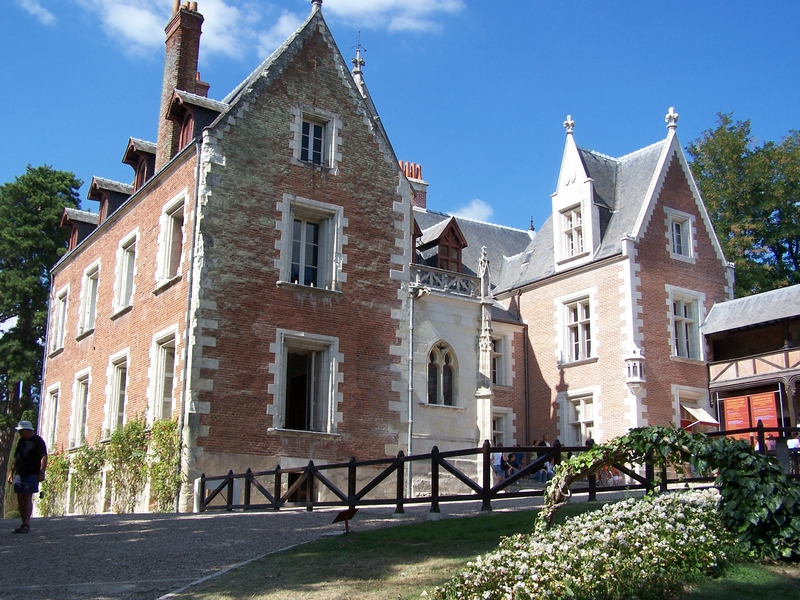
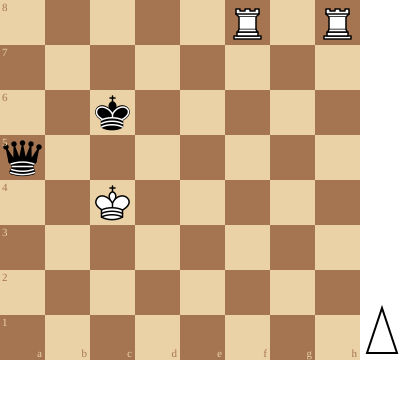

+++
date = '2026-08-03T18:10:36+02:00'
title = 'Torens versus Dame studies (2)'
+++

<!--
.image castle.jpg
-->

Manoir du Clos Lucé is de laatste verblijfplaats van Leonardo da Vinci.  

Hij liet er drie meesterwerken achter:

- De Mona Lisa
- Sint-Anna-in-drieën
- Johannes de Doper

Tegenwoordig is het een museum over het leven, werk en voorbeelden van uitvindingen van Leonardo da Vinci.

<!--
.diagram file:puzzle.pgn
-->

Toon hoe Wit wint!

<!--
.yt https://www.youtube.com/watch?v=Btlc9Fdd2N4&list=PLlN1WdzKJmlLS17Yu35d7HPJqvpL9VKwM
-->


Je kan de video ook bekijken op [dropbox](https://www.dropbox.com/scl/fi/fb65zbf58pgol11gqglkm/Could_Two_Rooks_Beat_a_Queen_Chess_Puzzle_Btlc9F.mp4?rlkey=yyu6lwkp8dvoabl769krfjqrp&dl=0)

<!--
.puzzle puzzle.pgn
-->

(Je kan de partij <a href="puzzle.pgn">hier</a> downloaden in PGN formaat)

&#160;

