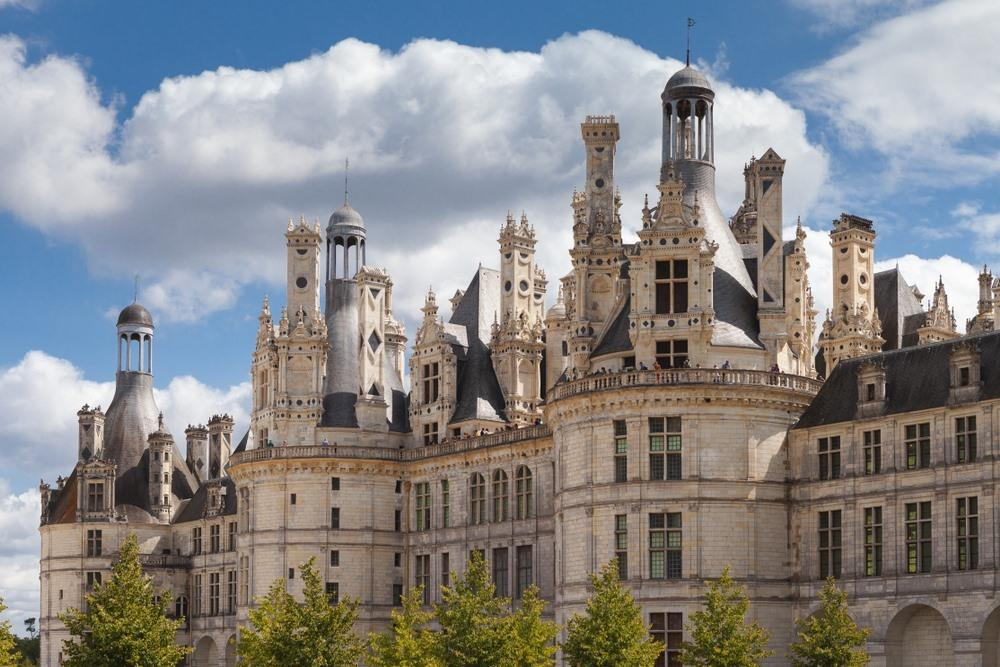
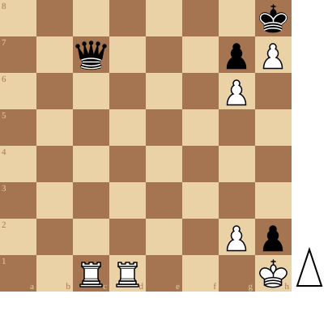

+++
date = '2026-08-09T18:14:16+02:00'
title = 'Torens versus Dame studies (4)'
+++

<!--
.image castle.jpg
-->

[Château de Chambord](https://www.reisroutes.be/blog/loirevallei/mooiste-kastelen-loire/) - de parel van de Loirevallei
Het Château de Chambord is het grootste kasteel van de Loirevallei. Voor velen is dit hét mooiste kasteel van de Loirevallei. Het is dan ook niet gek dat het Château de Chambord het meest bezochte kasteel in de regio is. Het kasteel werd door koning Frans I in de zestiende eeuw als jachtslot gebouwd. Daardoor werd ook het bos rondom het kasteel beschermd. Vandaag is het park rond het kasteel zelfs het grootste afgesloten bosgebied in Europa, het gebied is even groot als Parijs.

Dergelijk kasteel verdient een buitengewone puzzel.

De kern van de puzzel zijn de pat-dreigingen die de dame partij kan opzetten.

<!--
.diagram puzzle.pgn
-->

<!--
.yt https://www.youtube.com/watch?v=XujNn7HT2A0
-->


Je kan de video ook bekijken op [dropbox](https://www.dropbox.com/scl/fi/u28xmlfp2902pqfg2fp16/Hard_Chess_Puzzle_Two_Rooks_Against_A_Queen_XujN.mp4?rlkey=382xkmb8yhosqan4ii27pudgr&dl=0)

<!--
.puzzle puzzle.pgn
-->

(Je kan de partij <a href="puzzle.pgn">hier</a> downloaden in PGN formaat)

&#160;

