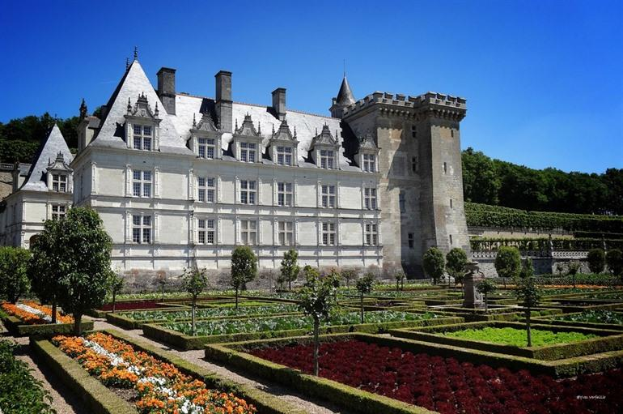
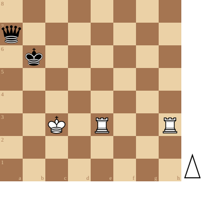

+++
date = '2026-08-11T17:20:50+02:00'
title = 'Torens versus Dame studies (5)'
+++

<!--
.image castle.jpg
-->

[Château de Villandry](https://www.reisroutes.be/blog/loirevallei/mooiste-kastelen-loire/)

Een plek vol geschiedenis

Het oorspronkelijke fort van Villandry werd al in de veertiende eeuw gebouwd door koning Filip II tegen de flank van een heuvel. Een lokale nobelman kocht het gebouw in de zestiende eeuw en liet een nog groter fort en een slotgracht aanleggen. Tijdens de Franse Revolutie werd het kasteel door de staat overgenomen en even later schonk keizer Napoleon het kasteel aan zijn broer Jérôme Bonaparte.

Prachtige kasteeltuinen

Aan het begin van de twintigste eeuw kocht de familie Carvallo het bouwwerk. Ze begonnen het kasteel te renoveren en schonken daarbij extra veel aandacht aan de renaissancetuinen. Die tuinen zijn nog steeds het hoogtepunt van een bezoek aan het kasteel. De tuinen zijn aangelegd in geometrische vormen en staan vol bloemen, struiken, fonteinen en zelfs groenten. Naast de tuinen ligt een bos waar je na een bezoek aan het kasteel een mooie wandeling kan maken.

Dergelijk kasteel verdient een puzzel om doorheen te slenteren (hint!)

Extra vraag: waarom beginnen met de ene toren en niet met de andere ?

<!--
.diagram puzzle.pgn
-->

<!--
.yt https://www.youtube.com/watch?v=mIvQ8-clRSI&list=PLlN1WdzKJmlLS17Yu35d7HPJqvpL9VKwM&index=13
-->


Je kan de video ook bekijken op [dropbox](https://www.dropbox.com/scl/fi/lqsdc9cywvfsz6jfr08gc/Find_White_s_Winning_Move_mIvQ8_clRSI.mp4?rlkey=7opd7139y81uejr906eneiz8d&dl=0)

<!--
.puzzle puzzle.pgn
-->

(Je kan de partij <a href="puzzle.pgn">hier</a> downloaden in PGN formaat)

&#160;

