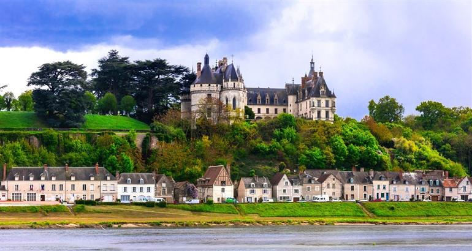
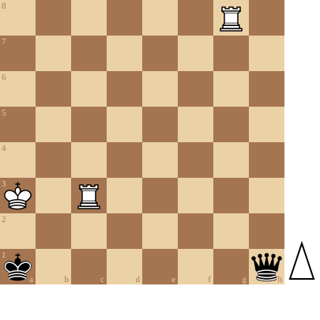

+++
date = 2026-08-11T17:20:50+02:00
title = "Torens versus Dame studies (6)"
weight = 9223372036646154557
+++

<!--
.image castle.jpg
-->

[Château Chaumont-Sur-Loire](https://www.reisroutes.be/blog/loirevallei/mooiste-kastelen-loire/)

Tussen Amboise en Blois staat het kasteel Chaumont-Sur-Loire, een kasteel gebouwd om het dorpje Blois te beschermen tegen aanvallen van de graven van Anjou. Het kasteel zelf is erg indrukwekkend van buitenaf. Het zijn voornamelijk de tuinen die het kasteel een bezoekje waard maken. Bovendien wordt elk jaar van april tot november het Internationaal Tuinenfestival in de kasteeltuinen georganiseerd. Er staan dan overal prachtige bloemen en er worden kunstzinnige landschapscreaties tentoongesteld.

Dit kasteel was gebouwd ter verdediging ...

Torens kunnen echter ook heel goed aanvallen:

<!--
.diagram puzzle.pgn
-->

<!--
.yt https://www.youtube.com/watch?v=_bAReGl5ceg&list=PLlN1WdzKJmlLS17Yu35d7HPJqvpL9VKwM&index=37
-->


Je kan de video ook bekijken op [dropbox](https://www.dropbox.com/scl/fi/5xblgoo5quznkuq8q5kqs/The_First_Move_Is_The_Hardest_White_Wins_bAReGl5.mp4?rlkey=590vls09jiykpm0uj6h9gy6hn&dl=0)

<!--
.puzzle puzzle.pgn
-->

(Je kan de partij <a href="puzzle.pgn">hier</a> downloaden in PGN formaat)

&#160;

