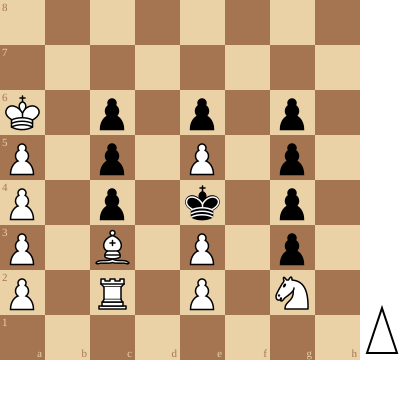

+++
date = '2026-08-30T18:56:37+02:00'
title = 'Sam Loyd (2)'
weight = 9223372036644507210
+++

De puzzels van Sam Loyd zijn net altijd wat anders: deze puzzel toont een eigenaardig geometrisch patroon.

<!--
.diagram puzzle.pgn
-->

<!--
.yt igR5xUpJ1A4
-->


Je kan de video ook bekijken op [dropbox](https://www.dropbox.com/scl/fi/wyi6x2ifs5g1h0l4yupb9/A_Crazy_Chess_Puzzle_With_Pieces_Lined_Up_On_Par.mp4?rlkey=8nwnjjlri1tinwji320qyoeqk&dl=0)

<!--
.puzzle puzzle.pgn
-->

(Je kan de partij <a href="puzzle.pgn">hier</a> downloaden in PGN formaat)

&#160;

