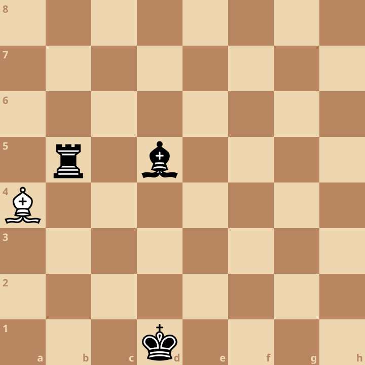

+++
date = 2026-02-26T16:54:10+01:00
title = "Raymond Smullyan puzzel"
weight = 9223372036660494957
+++

Raymond Merrill Smullyan (Mei 25, 1919 – Februari 6, 2017) was an Amerikaans wiskundige en filosoof die verscheidene boeken over schaken heeft geschreven.

Meer informatie kan je lezen op [Wikipedia](https://en.wikipedia.org/wiki/Raymond_Smullyan).

Zijn puzzels waren gericht op alternatief denken.

Een bekende puzzel van hem is de *ontbrekende koning*

Bij een schaakpartij viel de witte koning van het bord en de spelers wisten niet meer waar deze precies op het bord stond.

... en dit is de puzzel: je moet uitvinden waar de witte koning staat.

... en nee, je moet niet vragen wie aan zet is of dergelijke vragen meer.

Je kan dit ook in verhaalvorm bekijken op [dropbox](https://www.dropbox.com/scl/fi/22px1rql2mq6q388k56d4/smullyan.pdf?rlkey=co6sm99gb6i5nzoyq2bx8pzoz&st=bhbxf4a4&dl=0)
