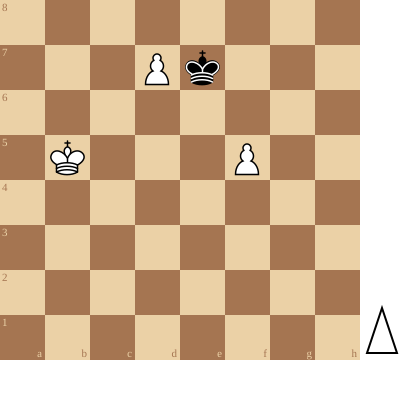

+++
date = 2026-05-13T13:19:01+02:00
title = "Test je kennis van het pionneneindspel"
weight = 9223372036653945066
+++

<!--
.diagram puzzle.pgn
-->

In 

<!--
.link articles/pawnbasic
-->
[Basis pionneneindspelen]() (artikel)

leerden we de elementaire pionneneindspelen.

Schaken is echter nooit eenvoudig zoals het volgende eindspel toont

<!--
.tube https://www.youtube.com/watch?v=mtPzy7adwbs&list=PLlN1WdzKJmlLS17Yu35d7HPJqvpL9VKwM&index=2
-->


<!--
.dropbox https://www.dropbox.com/scl/fi/psvad062dn1pbnfhns6mn/Test-Your-Endgame-Technique.mp4?rlkey=6q8vz6eecahydusc3wtfcv1sh&st=1ws4befd&dl=0
-->
Je kan de video ook bekijken op [dropbox](https://www.dropbox.com/scl/fi/psvad062dn1pbnfhns6mn/Test-Your-Endgame-Technique.mp4?rlkey=6q8vz6eecahydusc3wtfcv1sh&st=1ws4befd&dl=0)

<!--
.puzzle puzzle.pgn
-->

(Je kan de partij <a href="puzzle.pgn">hier</a> downloaden in PGN formaat)

&#160;

