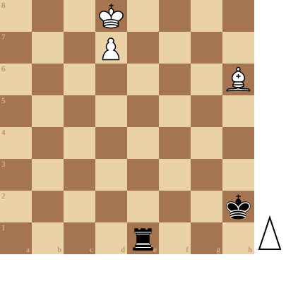

+++
date = 2026-05-12T18:59:22+02:00
title = "De witte loper haalt het van de zwarte toren"
weight = 9223372036654011045
+++

<!--
.diagram puzzle.pgn
-->

Wit moet 3 zaken oplossen:

- hij moet zijn koning beschermen tegen de schaakjes door de zwarte toren
- hij moet zijn pion beschermen
- hij moet zijn pion weten te promoveren

En dat lukt allemaal ...

<!--
.tube https://www.youtube.com/watch?v=ud7cjSkTT80&list=PLlN1WdzKJmlLS17Yu35d7HPJqvpL9VKwM&index=7
-->


<!--
.dropbox https://www.dropbox.com/scl/fi/7d6o1345f8xkd69i3oylh/Find-White-s-Winning-Move.mp4?rlkey=gewy01fdkzj5pqp4naje77e3n&st=p3p7byk8&dl=0
-->
Je kan de video ook bekijken op [dropbox](https://www.dropbox.com/scl/fi/7d6o1345f8xkd69i3oylh/Find-White-s-Winning-Move.mp4?rlkey=gewy01fdkzj5pqp4naje77e3n&st=p3p7byk8&dl=0)

<!--
.puzzle puzzle.pgn
-->

(Je kan de partij <a href="puzzle.pgn">hier</a> downloaden in PGN formaat)

&#160;

