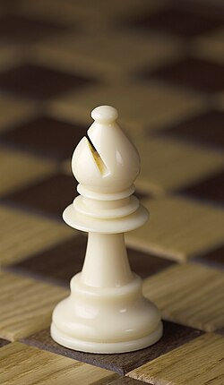
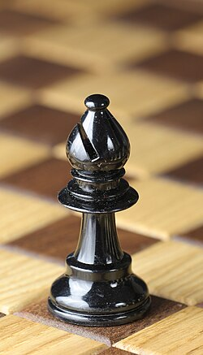
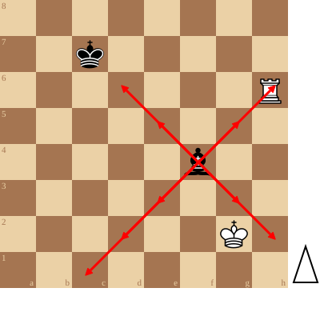

+++
date = '2026-09-11T12:01:34+02:00'
title = 'De loper'
weight = 9223372036643495313
+++

<!--
.image wbishop.jpg
-->

<!--
.image bbishop.jpg
-->

<!--
.diagram fen:8/2k5/7R/8/5b2/8/6K1/8 w - - 0 1; arrowred:f4e5,f4d6,f4g5,f4g3,f4h2,f4e3,f4d2,f4c1,f4h6
-->

De [loper](https://nl.wikipedia.org/wiki/Loper_(schaken)) (de nar, bisschop) werkt langs de diagonalen. Dit betekent nog dat de loper steeds op zijn kleur blijft. Elke speler heeft dus een 'witte' loper en een 'zwarte' loper.

Lopers zijn zwakker dan de torens maar het loperpaar kan heel sterk zijn.

Met coördinaten:

de loper op f4 kan naar de velden e5, d6, g5, g3, h2, h6, e3, d2, c1

