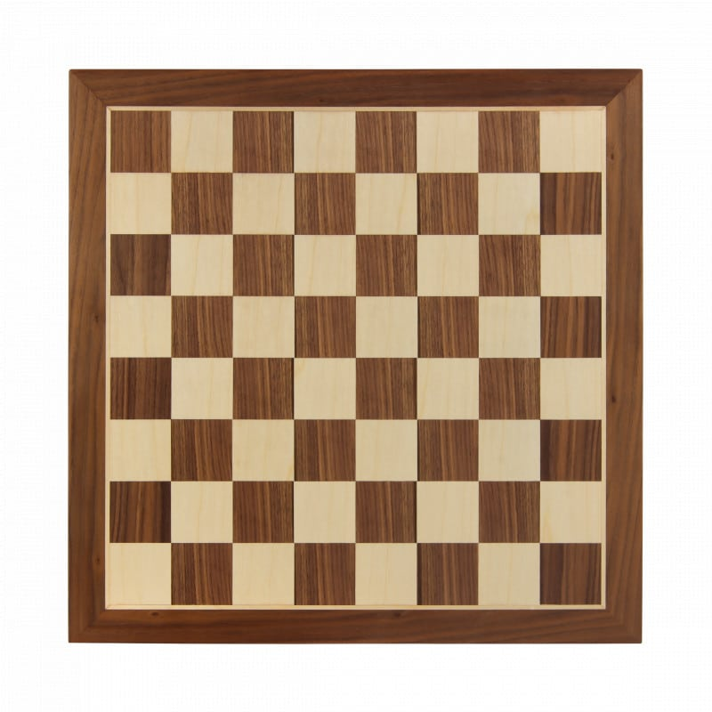
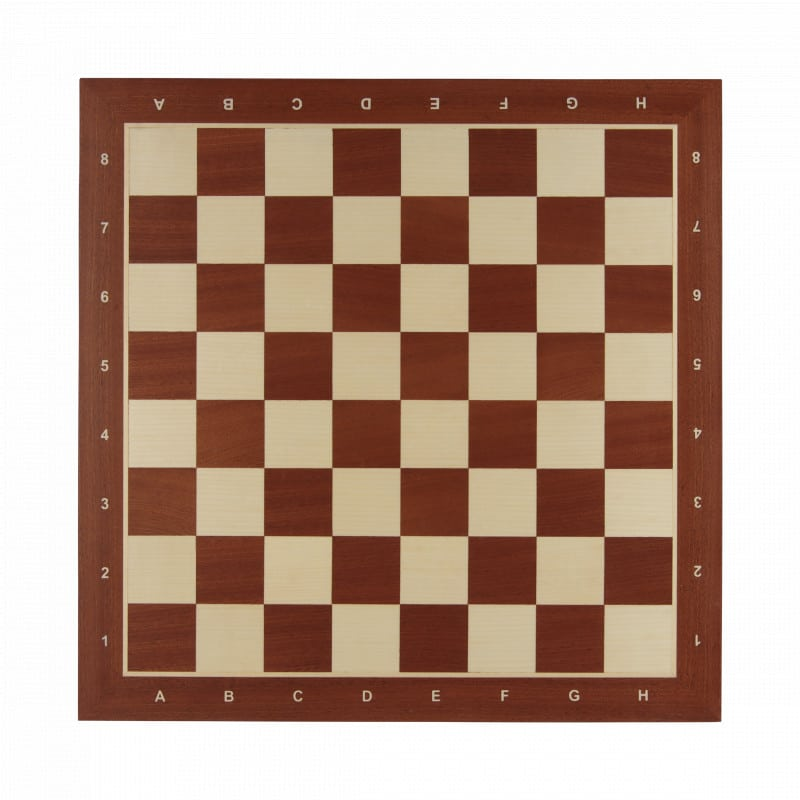

+++
date = '2026-09-08T09:51:48+02:00'
title = 'Schaakbord'
weight = 9223372036643762299
+++

Het [schaakbord](https://en.wikipedia.org/wiki/Chessboard) is het terrein waar de schaakpartij wordt beslecht.

Schaakborden worden gemaakt in heel diverse materialen en komen in alle prijsklassen.

Het is belangrijk om zich te realiseren dat FIDE een aantal regels heeft opgesteld waaraan een schaakbord moet voldoen.

Een bord dat in officiële partijen wordt gebruikt moet *velden* hebben van 50 mm tot 60 mm (1.97 to 2.36 inches), waarbij 55 mm als 'ideaal' wordt gezien.

Essentieel komen schaakborden in twee varianten: deze met coördinaten en deze zonder coördinaten. Ikzelf vind borden zonder coördinaten gewoon mooier, beginnende schakers vinden borden met coördinaten gemakkelijker.

<!--
.image bord.jpg
-->

<!--
.image bordc.jpg
-->

Een schaakbord is ingedeeld in 8 rijen en 8 lijnen. Dit maakt dat er 64 velden zijn. Elk van deze velden heeft een 'kleur' die steeds met 'wit' en 'zwart' wordt aangeduid.

Een verhaal uit de Arabische wereld gaat over een Sultan die leerde schaken van zijn grootvizier en zo verrukt was over het spel dat deze een geschenk mocht kiezen. De grootvizier vroeg gewoon een graankorrel op het eerste veld en dan 2 op het tweede veld, dan 4 op het derde, 8 op het vierde, 16 op ... Als een graankorrel 50mg weegt, reken eens uit hoeveel tarwe de grootvizier vroeg! (Antwoord: 1 000 000 000 000 000 ton)

Elke rij wordt genummerd met een getal van '1' tot '8' en elke lijn heeft een letter van 'a' tot 'h'. Dit maakt dat elk veld een coördinaat heeft. De X-coördinaat is de lijn van het veld en is dus een letter. De Y-coördinaat is het cijfer bij de rij.

Het bord wordt tussen de spelers geplaatst op zodanige wijze dat aan de linkerhand van beide spelers zich een zwart veld bevindt. Heeft het bord coördinaten, dan schik je het bord zo dat het veld *a1* zich aan de linkerhand van de Wit-speler bevindt

Het is belangrijk om een goed gevoel te krijgen bij de plaats waar een veld zich bevindt. Kan je me zeggen welke kleur het veld 'f7' heeft ?

De volgende video toont hoe een ambachtsman een schaakbord vervaardigt.

<!--
.yt a3EVqOPJ0UM
-->


Je kan de video ook bekijken op [dropbox](https://www.dropbox.com/scl/fi/qgxpkot3b94bj4v21zklv/Making_a_Walnut_and_Maple_Chess_Board_Tutorial_a.mp4?rlkey=avckj5c6gojavjt9c4wl8az0x&dl=0)

