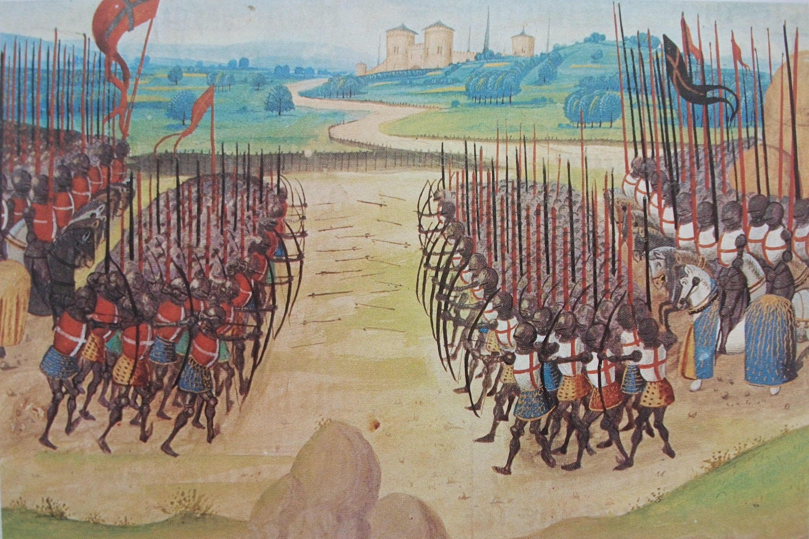

+++
date = '2026-09-07T17:09:42+02:00'
title = 'Het doel van een partij schaak'
weight = 9223372036643822425
+++
<!--
.image azincourt.jpg
-->

Schaken is een oorlogsspel.

De oorsprong is te vinden in het India van de 6e eeuw en kreeg zijn definitieve vorm in West-Europa in de 19e eeuw.

De 2 partijen - steeds Wit en Zwart genaamd - staan lijnrecht over elkaar. Er is geen verborgen informatie. Niets wordt aan het toeval overgelaten.

In elk der twee legers bevindt zich precies 1 koning. Het leger dat er in slaagt deze koning te veroveren - zonder dat deze weerwerk kan bieden - wint het pleit.
Het doet er niet toe hoeveel strijders een leger verliest of wint: enkel de eigen koning en de vijandelijke koning zijn bepalend.

Het spel heeft 1 van 3 mogelijke resultaten:

- Wit wint

- Zwart wint

- De partij wordt gelijkspel (*remise*) verklaard.

Later worden deze situaties nader toegelicht.

In het schaakspel **moet** elke speler om beurt een zet uitvoeren, ook indien deze zet nadelig blijk te zijn en Wit **moet** beginnen.

