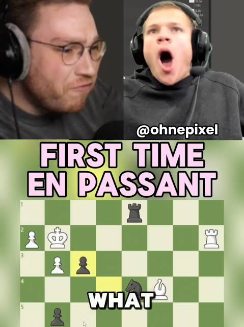
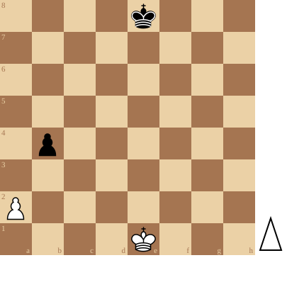
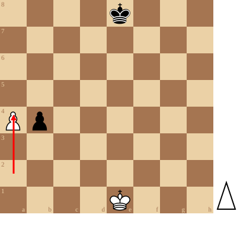
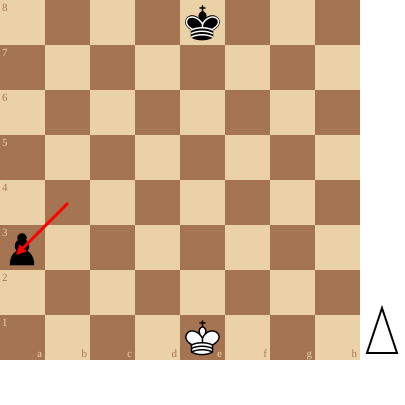

+++
date = '2026-09-11T19:24:25+02:00'
title = 'En passant slaan'
weight = 9223372036643468742
+++

<!--
.image image.jpg
-->

In deze stelling is Wit aan zet en er is nog niets aan de hand.

<!--
.diagram fen:4k3/8/8/8/1p6/8/P7/4K3 w - - 0 1
-->

Wit speelt zijn a-pion 2 zetten vooruit en passeert dus de zwarte pion!

<!--
.diagram fen:4k3/8/8/8/Pp6/8/8/4K3 w - - 0 1; redarrow:a2a4
-->

Zwart vindt dit onrechtvaardig en volgende de *en passant regel* mag hij doen alsof de pion naar a3 (in plaats naar a4) is gegaan. Hij kan dus de pion slaan.
Hij moet dit wel ogenblikkelijk doen!

<!--
.diagram fen:4k3/8/8/8/8/p7/8/4K3 w - - 0 1; redarrow:b4a3
-->

[En passant](https://nl.wikipedia.org/wiki/En_passant_slaan) slaan (Frans voor in het voorbijgaan, terloops) is een bijzondere zet in het schaakspel. Het is een zet die bij beginnende schakers niet zeer bekend is.

Bij en passant slaan zijn uitsluitend pionnen betrokken: alleen een pion kan en passant slaan en alleen een pion kan en passant geslagen worden.

Een pion mag in de uitgangsstelling twee velden vooruit. Als hij daarbij naast een pion van de tegenstander komt te staan, dan mag die pion hem slaan alsof a slechts één veld vooruit was gezet. Alleen een pion die net een dubbele stap heeft gemaakt kan *en passant* geslagen worden en dat kan alleen bij de zet direct daarna. Doet de tegenstander eerst een andere zet, dan kan hij de pion niet meer *en passant* slaan.

Een gevoelsmatige rechtvaardiging voor het bestaan van deze regel is dat een pion anders een vijandelijke pion zou kunnen passeren, zonder dat deze in de gelegenheid is geweest hem te slaan.

*En passant* slaan is de enige slagzet in het schaakspel waarbij het stuk dat slaat niet op het veld van het geslagen stuk terechtkomt.

