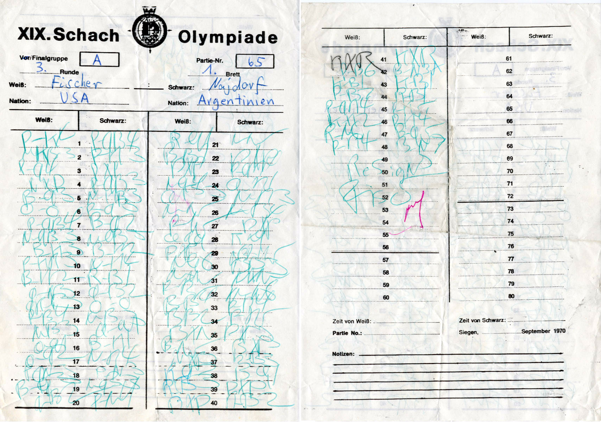

+++
date = '2026-09-12T18:13:33+02:00'
title = 'Vijftigzettenregel'
weight = 9223372036643386594
+++

<!--
.image 50.jpg
-->

De [vijftigzettenregel](https://nl.wikipedia.org/wiki/Vijftigzettenregel) is een spelregel in het schaakspel, waardoor een partij in remise kan eindigen. Wanneer er door beide spelers vijftig zetten zijn gespeeld zonder dat een pion is verzet of een stuk is geslagen kan een speler remise opeisen. De speler die dit doet moet de eis onderbouwen met een volledig ingevuld notatieformulier.

