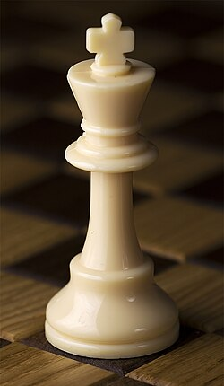
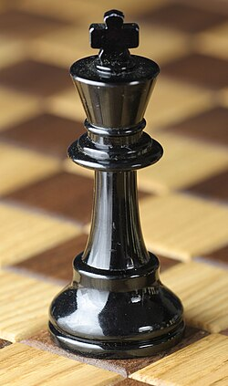
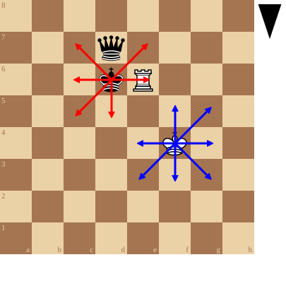

+++
date = '2026-09-09T16:10:46+02:00'
title = 'De koning'
weight = 9223372036643653161
+++

<!--
.image wking.jpg
-->

<!--
.image bking.jpg
-->

<!--
.diagram fen:8/3q4/3kR3/8/5K2/8/8/8 b - - 0 1; redarrow:d6c6,d6c5,d6c7,d6e7,d6e6,d6d5; bluearrow:f4f5,f4g5,f4g4,f4g3,f4f3,f4e3,f4e4
-->

De [koning](https://nl.wikipedia.org/wiki/Koning_(schaken)) kan naar de naburige velden gaan tenzij:

- er staat daar een stuk van eigen kleur

- hij staat daar schaak. In het bijzonder: hij komt naast de vijandelijke koning te staan

Een koning kan dus naar maximaal 8 velden gaan.

Met coördinaten:

- de witte koning op f4 kan naar e3, e4, f5, g5, g4, g3 en f3

- de zwarte koning kan naar c7, e7, e6, d5, c5 en c6

