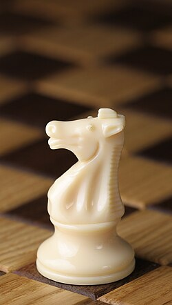
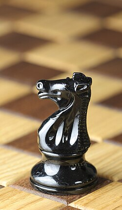
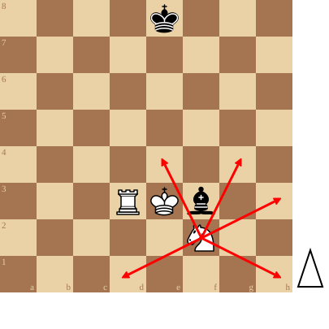

+++
date = '2026-09-11T18:34:36+02:00'
title = 'Het paard'
weight = 9223372036643471731
+++

<!--
.image wknight.jpg
-->

<!--
.image bknight.jpg
-->

Het paard beweegt altijd ofwel één veld horizontaal en vervolgens twee velden verticaal, ofwel één veld verticaal en vervolgens twee velden horizontaal. Een andere manier om dit te formuleren is dat het beginveld en het eindveld een L-vorm hebben. Of: een paard mag worden verplaatst naar een van de dichtstbijzijnde velden die niet op dezelfde lijn, rij of diagonaal liggen als waarop het staat. Hierdoor gaat een paard bij iedere zet van een zwart naar een wit veld of omgekeerd.

Het paard is het enige schaakstuk dat mag springen, dat wil zeggen: de tussenliggende velden mogen bezet zijn, zowel door eigen stukken als door stukken van de tegenstander. Het eindveld moet wel leeg zijn of bezet worden door een vijandelijk stuk.

<!--
.diagram fen:4k3/8/8/8/8/3RKb2/5N2/8 w - - 0 1; redarrow: f2d1,f2e4,f2g4,f2h3,f2h1
-->

Een paard dat aan de rand staat ziet zijn actie-radius ernstig beperken en in een hoek kan het paard naar maximaal 2 velden. Toch is het paard een te duchten stuk: vooral in samenwerking met de koningin is het aartsgevaarlijk.

Met coördinaten: het paard op f2 kan naar d1, e4, g4, h32, h1

