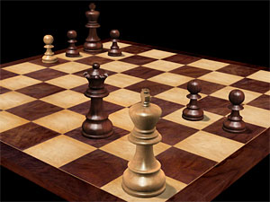
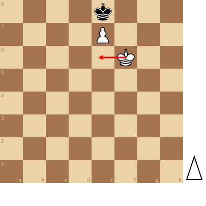

+++
date = '2026-09-11T20:52:28+02:00'
title = 'Pat !?'
weight = 9223372036643463459
+++

<!--
.image pat.jpg
-->

Een [patstelling](https://nl.wikipedia.org/wiki/Patstelling) of kortweg pat is een situatie in het schaakspel, waarin de speler die aan zet is geen reglementaire zet kan doen en niet schaak staat. De partij eindigt bij een patstelling in remise.

Voor de speler die sterk staat, is remise onvoordelig; hij wil daarom pat voorkomen. Als de tegenstander vrijwel geen materiaal meer heeft, maar nog niet opgeeft, moet de potentiële winnaar behoedzaam spelen en opletten dat hij geen pat veroorzaakt. Voor de speler die zwak staat, is remise voordelig. 

<!--
.diagram fen:4k3/4P3/5K2/8/8/8/8/8 w - - 0 1; redarrow: f6e6
-->

