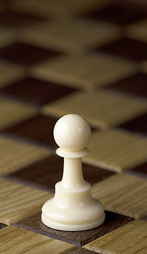
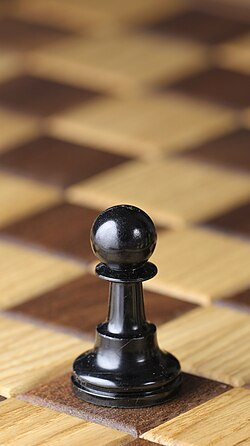
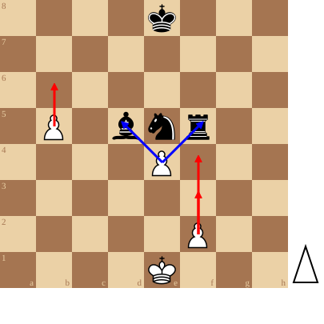

+++
date = '2026-09-11T18:43:34+02:00'
title = 'De pion'
weight = 9223372036643471193
+++

<!--
.image wpawn.jpg
-->

<!--
.image bpawn.jpg
-->

<!--
.diagram fen:4k3/8/8/1P1bnr2/4P3/8/5P2/4K3 w - - 0 1; redarrow:b5b6,f2f3,f2f4; bluearrow:e4d5,e4f5
-->

De [pion](https://nl.wikipedia.org/wiki/Pion_(schaken)) is zeker het meest merkwaardige stuk op een schaakbord.

Het is het zwakste stuk maar er zijn er wel veel van: bij aanvang heeft elke speler er 8.

In tegenstelling tot de andere stukken kan de pion enkel vooruit gaan (voor wit: als een pion beweegt, komt hij steeds tercht op een hogere rij; voor zwart: pionnen bewegen steeds naar een lagere rij)

Wat werkelijk heel speciaal is, is de promotie: deze gebeurt op hetzelfde moment als de pion de laatste (eerste) rij bereikt.

Ook speciaal is dat de pion *niet* slaat zoals hij loopt! Hij slaat diagonaal.

Dit betekent dat oprukkende pionnen van verschillende kleur mekaar blokkeren!

Pionnen hebben nog speciale eigenschappen: 

- een pion die reeds heeft gespeeld, mag slechts 1 zet vooruitgaan
- een pion die nog niet heeft gespeeld., mag kiezen: hij gaat 1 zet vooruit of hij gaat 2 zetten vooruit

We behandelen nog de 2 heel aparte elementen

<!--
- .link rules/promotion
-->
- [De promotie]() (reglement)

<!--
- .link rules/enpassant
-->
- [En passant slaan]() (reglement)

