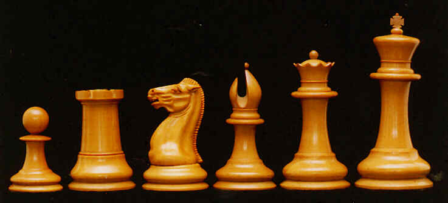
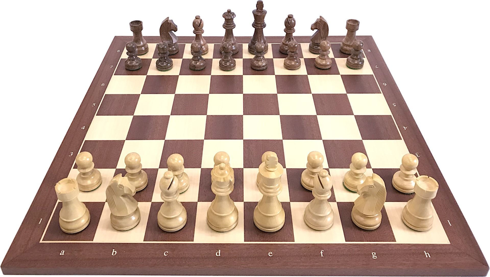
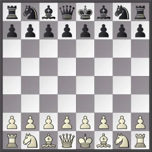

+++
date = '2026-09-08T17:52:14+02:00'
title = 'Stukken en pionnen'
weight = 9223372036643733473
+++

<!--
.image pieces.jpg
-->

De [schaakstukken](https://en.wikipedia.org/wiki/Chess_piece) zijn de soldaten op het slachtveld.

Beide legers hebben dezelfde stukken: een koning, een koningin, 2 lopers, 2 paarden, 2 torens.

Ze hebben beiden ook 8 pionnen.

De FIDE schrijft de vorm en de afmetingen van de pionnen en stukken voor. Ook de afmetingen tegenover het schaakbord liggen vast.

De koning is het grootste stuk en de voet van dit stuk moet tussen de 39,6mm en de 45,1mm liggen als de maat van de velden 55mm is!
Zijn hoogte bedraagt 9,5cm.

De Engelse grootmeester Howard Staunton standaardiseerde in 1849 het 'officiele' schaakbord met een klemtoon op soberheid.

Een fysiek schaakbord:

<!--
.image bord.jpg
-->

Een schaakdiagram zoals die in boeken of op computer wordt gebrukt:

<!--
.image bordd.jpg
-->

In het begin van de partij staan de koning en de koningin centraal op de eerste (laatste) rij. Merk op dat de koningin steeds 'a sorti' is: ze staat op haar kleur.

Het koningspaar wordt geflankeerd door de lopers. In Frankrijk worden deze de narren genoemd en in Angelsaksische landen heten ze de bisschoppen.

Naast de lopers staan de paarden. In de hoeken vind je de torens. 

Dit zijn de 8 stukken en voor hen bevindt zich het voetvolk: de pionnen.

Schakers hechten veel belang aan de stukken en hoe ze zich verhouden tot het bord.

Dit wordt door het volgende filmpje ten overvloede aangetoond.

<!--
.yt zJeVid62NZo
-->


Je kan de video ook bekijken op [dropbox](https://www.dropbox.com/scl/fi/bf5irhlasi3cg06fd77kw/Best_Chessboard_Size_zJeVid62NZo.mp4?rlkey=ghpxmy3ysx4z34l173mu8qi2z&dl=0)

