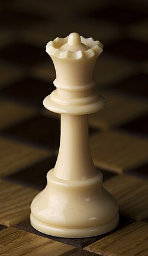
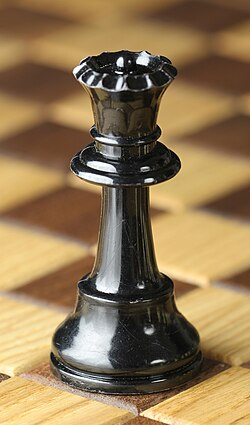
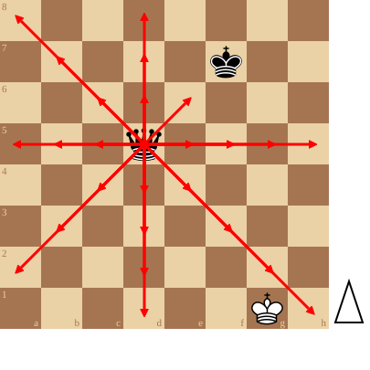

+++
date = '2026-09-10T14:34:00+02:00'
title = 'De koningin'
weight = 9223372036643572567
+++

<!--
.image wqueen.jpg
-->

<!--
.image bqueen.jpg
-->

<!--
.diagram fen:8/5k2/8/3q4/8/8/8/6K1 w - - 0 1; redarrow:d5d1,d5d2,d5d3,d5d4,d5a2,d5b3,d5c4,d5c5,d5b5,d5a5,d5c6,d5b7,d5a8,d5d6,d5d7,d5d8,d5e6,d5e5,d5f5,d5g5,d5h5,d5e4,d5f3,d5g2,d5h1
-->

De [koningin](https://nl.wikipedia.org/wiki/Dame_(schaken)) is het sterkste stuk op het bord: net zoals de koning, kan ze in alle richtingen. Ze wordt enkel gestopt door de rand van het bord of een bezet veld. Wordt het veld bezet door de vijand, dan kan ze deze steeds slaan (=veroveren).

Met coördinaten:

de zwarte dame op d5 kan naar d1, d2, d3, d4, a2, b3, c4, c5, b5, a5, c6, b7, a8, d6, d7, d8, e6, e5, f5, g5, h5, e4, f3, g2, h1

