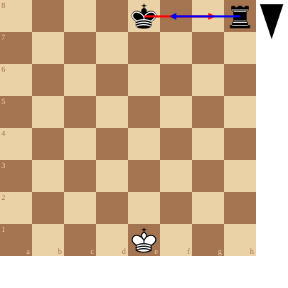
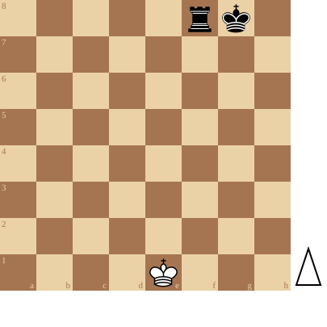
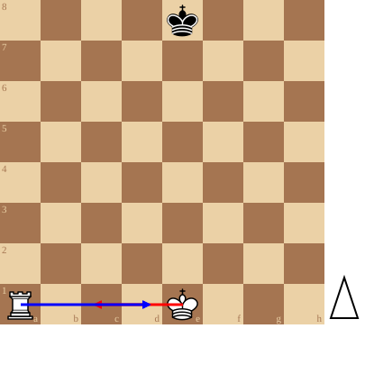
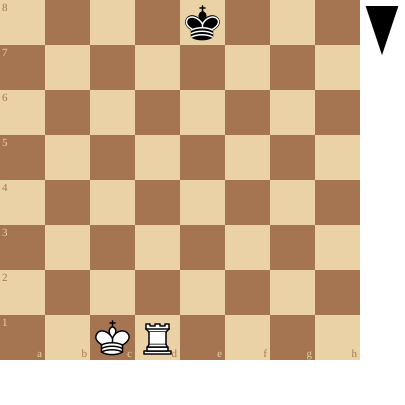
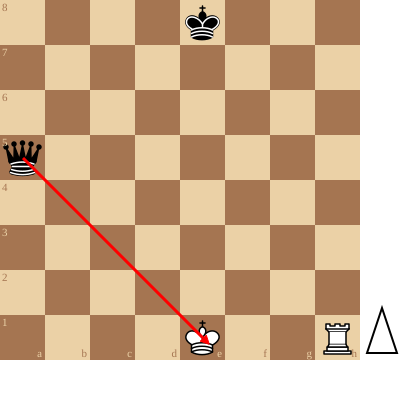
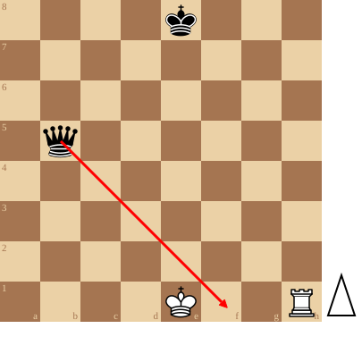
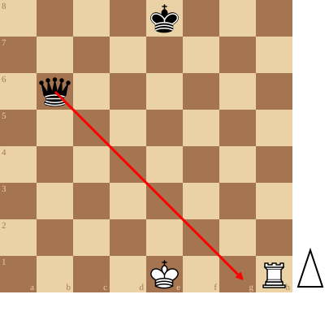
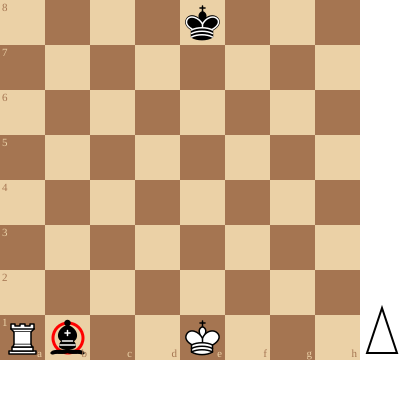

+++
date = '2026-09-11T18:06:46+02:00'
title = 'De rokade'
weight = 9223372036643473401
+++

Voor de korte rokade:

<!--
.diagram fen:4k2r/8/8/8/8/8/8/4K3 b - - 0 1; redarrow:e8g8;bluearrow:h8f8
-->

Na de korte rokade:

<!--
.diagram fen:5rk1/8/8/8/8/8/8/4K3 w - - 0 1
-->

Voor de lange rokade:

<!--
.diagram fen:4k3/8/8/8/8/8/8/R3K3 w - - 0 1; redarrow:e1c1;bluearrow:a1d1
-->

Na de lange rokade:

<!--
.diagram fen:4k3/8/8/8/8/8/8/2KR4 b - - 0 1
-->

De [rokade](https://nl.wikipedia.org/wiki/Rokade) (Engels: Castling) is een bijzondere zet in het schaakspel. Het is de enige zet waarbij twee stukken van dezelfde kleur verplaatst worden (namelijk de koning en de toren). Voert men een rokade uit, dan heet dat rokeren.

Het doel van de rokade is om de koning zo snel mogelijk in veiligheid te brengen.

Het zet gaat dus altijd met 2 stukken: de koning en een toren van dezelfde kleur.

Technisch wordt de koning vastgenomen, en 2 zetten in de richting van de toren geplaatst. Dan wordt de andere toren vastgenomen en naast de koning geplaatst. De toren springt hierbij over de koning.

Er zijn een aantal voorwaarden die moeten worden voldaan vooraleer er mog worden gerokeerd:

- de koning mag slechts 1x rokeren gedurende een partij
- de koning mag nog niet hebben gespeeld.
- de toren - betrokken bij de rokade - mag nog niet hebben gespeeld
- tussen koning en de betreffende toren mogen er zich geen stukken bevinden
- de koning mag niet schaak staan
- het veld - in de richting van de toren - naast de koning, mag niet worden aangevallen door de vijand
- het veld waar de koning op terecht komt, mag niet aangevallen zijn door de vijand

Er zijn twee vormen van rokade mogelijk: de korte rokade en de lange rokade. Bij de korte rokade beweegt de betreffende toren over 2 velden, bij de lange rokade is dit over 3 velden.

De rokade is een belangrijk onderdeel van het schaakspel en niet kunnen rokeren wordt gezien als een belangrijk positioneel nadeel.

Rokade is niet mogelijk: de koning staat schaak

<!--
.diagram fen:4k3/8/8/q7/8/8/8/4K2R w - - 0 1; redarrow:a5e1
-->

Rokade is niet mogelijk: het veld naast de koning wordt aangevallen

<!--
.diagram fen:4k3/8/8/1q6/8/8/8/4K2R w - - 0 1; redarrow:b5f1
-->

Rokade is niet mogelijk: het veld waar de koning op terecht komt wordt aangevallen

<!--
.diagram fen:4k3/8/1q6/8/8/8/8/4K2R w - - 0 1; redarrow:b6g1
-->

Rokade is niet mogelijk: er bevindt zich stuk tussen toren en koning

<!--
.diagram fen:4k3/8/8/8/8/8/8/Rb2K3 w - - 0 1; circle:b1
-->

