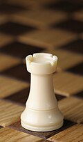
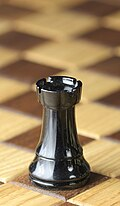
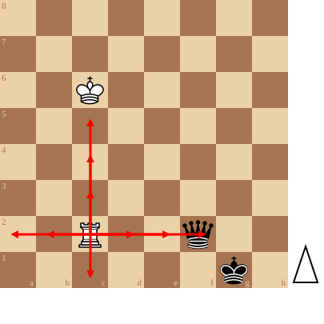

+++
date = '2026-09-10T15:19:15+02:00'
title = 'De toren'
weight = 9223372036643569852
+++

<!--
.image wrook.jpg
-->

<!--
.image brook.jpg
-->

<!--
.diagram fen:8/8/2K5/8/8/8/2R2q2/6k1 w - - 0 1; redarrow: c2a2,c2b2,c2d2,c2e2,c2f2,c2c1,c2c3,c2c4,c2c5
-->

De [torens](https://nl.wikipedia.org/wiki/Toren_(schaken)) zijn als tanks: ze bewegen horizontaal en vertikaal. Ze missen de mogelijkheid van de koningin om ook diagonaal te gaan.

Met coördinaten: de toren op c2 kan naar a2, b2, d2, e2, f2, c1, c3, c4, c5

<!--
De toren heeft - samen met de koning - nog een speciale beweging: .link rules/rokade
-->
De toren heeft - samen met de koning - nog een speciale beweging: [De rokade]() (reglement)

