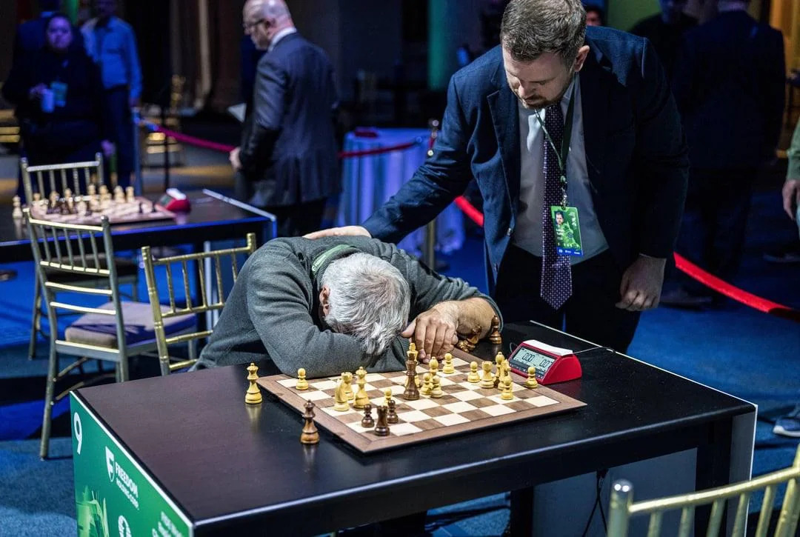
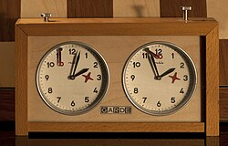
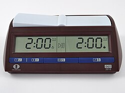

+++
date = '2026-09-11T20:40:36+02:00'
title = 'Schaakklokken en tijd'
weight = 9223372036643464171
+++

<!--
.image trouble.jpg
-->

<!--
.image atime.jpg
-->

<!--
.image dtime.jpg
-->

Er werd heel lang met analoge [schaakklokken](https://nl.wikipedia.org/wiki/Wedstrijdklok) gespeeld. Deze zijn nu grotendeels vervangen door digitale klokken.

Niet alleen zijn deze nauwkeuriger, beter bestand tegen het geweld van de schakers maar er zijn ook mogelijkheden tot het automatisch bijgeven van extra tijd.

Tijd is heel erg belangrijk in het moderne schaak: de spelers moeten hun zetten doseren zodanig dat deze kunnen worden uitgevoerd binnen de hen toegemeten tijd.

<!--
.yt 8RMxDENR9mM
-->


Je kan de video ook bekijken op [dropbox](https://www.dropbox.com/scl/fi/nt5tkznxyculfzgslh6ek/Heartfelt_Showdown_Vasyl_Ivanchuk_s_Emotional_Mo.mp4?rlkey=3gscw41apk57ye2hbcz31ghte&dl=0)

<!--
.yt IYPrEyIjDvc
-->


Je kan de video ook bekijken op [dropbox](https://www.dropbox.com/scl/fi/7nszoz87fe450isltk0pu/Ivanchuk_CRIES_After_Losing_on_Time_Chess_is_BRU.mp4?rlkey=nbqa7x0dta1y0lb9eqae6xd8u&dl=0)
