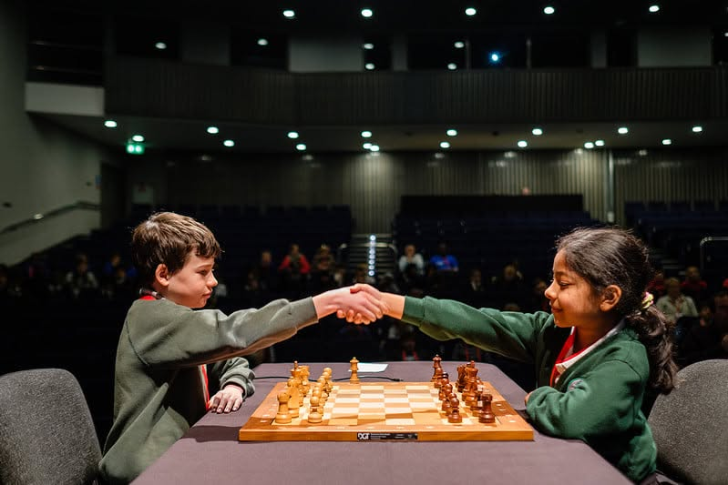
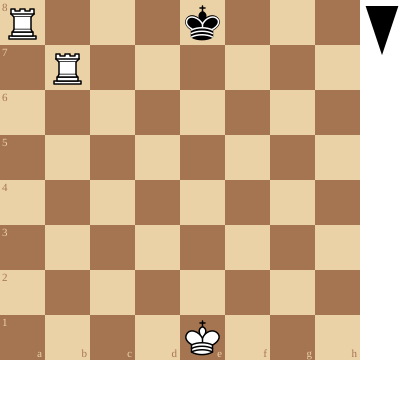
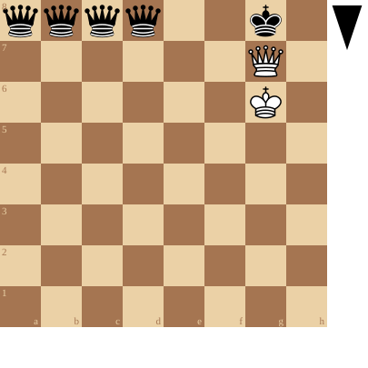
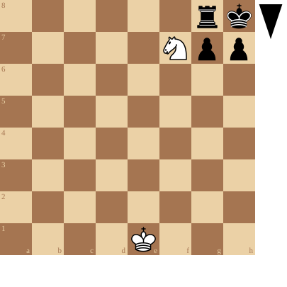
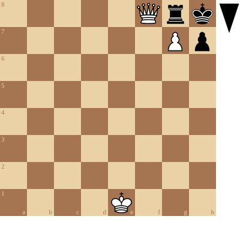
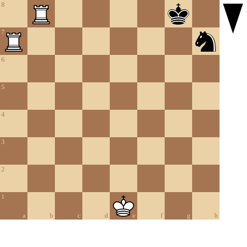
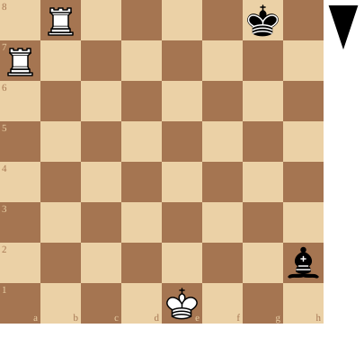
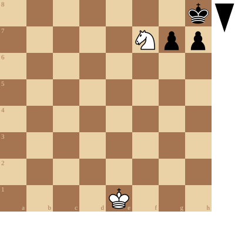

+++
date = '2026-09-11T19:44:21+02:00'
title = 'Hoe win je een schaakpartij ?'
weight = 9223372036643467546
+++

<!--
.image image.jpg
-->

Een schaakpartij wordt essentieel gewonnen door de vijandelijke koning te veroveren.
De koning staat dan **schaakmat**

Echter ...

Het veroveren van de koning betekent het volgende:

- de koning staat schaak (hij is aangevallen)

- de aanvaller kan zelf niet worden geslagen

- er kan geen stuk worden geplaatst tussen de aanvaller en de koning

- de koning kan niet meer vluchten.

In de volgende stellingen staat Zwart schaakmat!

<!--
.diagram fen:R3k3/1R6/8/8/8/8/8/4K3 b - - 0 1
-->

<!--
.diagram fen:qqqq2k1/6Q1/6K1/8/8/8/8/8 b - - 0 1
-->

<!--
.diagram fen:6rk/5Npp/8/8/8/8/8/4K3 b - - 0 1
-->

<!--
.diagram fen:5Qrk/6Pp/8/8/8/8/8/4K3 b - - 0 1
-->

In de volgende stellingen staat Zwart **niet** schaakmat!

<!--
.diagram fen:1R4k1/R6n/8/8/8/8/8/4K3 b - - 0 1
-->

<!--
.diagram fen:1R4k1/R7/8/8/8/8/7b/4K3 b - - 0 1
-->

<!--
.diagram fen:7k/5Npp/8/8/8/8/8/4K3 b - - 0 1
-->

Er zijn echter nog andere redenen waarom je een partij kan verliezen:

- je staat schaakmat

<!--
- je verliest op tijd: .link rules/time
-->
- je verliest op tijd: [Schaakklokken en tijd]() (reglement)

- de scheidsrechter beslist dat je verliest

- je geeft op

